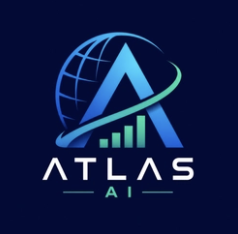

# Atlas AI — Financial Assistant for Telegram

Atlas AI is an AI-powered financial assistant that lives inside Telegram.

It combines conversational AI with live market data, company research, personalized watchlists, stock-movement alerts, morning briefings, document intelligence, conversation memory, and a real-time Mission Control dashboard.

Built as an end-to-end AI financial assistant project with a focus on **grounded financial responses, proactive intelligence, and natural conversation**.



---

## Table of Contents

- [Overview](#overview)
- [Features](#features)
- [Demo Conversations](#demo-conversations)
- [System Architecture](#system-architecture)
- [How Atlas Works](#how-atlas-works)
- [Tech Stack](#tech-stack)
- [Project Structure](#project-structure)
- [Installation](#installation)
- [Environment Configuration](#environment-configuration)
- [Telegram Bot Setup](#telegram-bot-setup)
- [Gemini API Setup](#gemini-api-setup)
- [Running the Project](#running-the-project)
- [Conversational Onboarding](#conversational-onboarding)
- [Market Intelligence](#market-intelligence)
- [Company Research](#company-research)
- [Watchlists](#watchlists)
- [Price Alerts](#price-alerts)
- [Morning Briefings](#morning-briefings)
- [Document Intelligence](#document-intelligence)
- [Conversation Memory](#conversation-memory)
- [Mission Control Dashboard](#mission-control-dashboard)
- [Dashboard API](#dashboard-api)
- [Database](#database)
- [Background Scheduler](#background-scheduler)
- [Google Integrations](#google-integrations)
- [Security](#security)
- [Testing](#testing)
- [Troubleshooting](#troubleshooting)
- [Current Scope](#current-scope)
- [Future Improvements](#future-improvements)
- [Engineering Principles](#engineering-principles)
- [Disclaimer](#disclaimer)
- [Author](#author)

---

# Overview

Atlas AI is designed to act like a financial research assistant inside Telegram.

Instead of forcing users to learn commands, dashboards, or complicated workflows, Atlas accepts normal language such as:

```text
What's moving Nvidia today?
```

```text
Compare Apple and Microsoft
```

```text
Alert me when Nvidia moves more than 5%
```

```text
Give me my morning briefing
```

Atlas interprets the request, retrieves relevant information, uses Gemini to reason over the retrieved context, stores useful data in the database, and responds directly inside Telegram.

The same database powers a separate **Mission Control dashboard** for monitoring:

- Users
- Conversations
- Watchlists
- Alerts
- Message volume
- Tracked symbols
- Briefings

---

# Features

## Telegram AI Assistant

- Natural-language conversations
- No complicated menus
- `/start` onboarding
- Text-message handling
- Voice/audio handling
- Image handling
- Document handling
- Conversation context

## Financial Intelligence

- Stock quote retrieval
- Previous close
- Price movement
- Percentage movement
- Company research
- Company comparisons
- Financial news
- Earnings information
- Watchlist management

## Alerts

- Conversational alert creation
- Percentage-movement alerts
- Background polling
- Per-user alerts
- Active-alert tracking
- Alert persistence in SQLite

## Personalized Briefings

- Morning briefing generation
- Watchlist-aware summaries
- Role-aware responses
- Market-news context
- User-preference context
- Briefing history
- Scheduled proactive delivery

## User Personalization

- Conversational onboarding
- Role detection
- Followed companies
- Watchlists
- Preferred briefing time
- Conversation history
- User preferences

## Document Intelligence

- PDF processing
- Image processing
- Document summarization
- Financial-document Q&A
- Follow-up questions against the most recently processed document

## Mission Control Dashboard

- Live user statistics
- Onboarding completion
- Messages in last 24 hours
- Active alerts
- Briefings sent
- Message-volume chart
- Most-tracked-symbols chart
- Live conversation feed
- User table
- Watchlist visualization
- Briefing history

---

# Demo Conversations

## Market Question

User:

```text
What's moving Nvidia today?
```

Atlas retrieves available market context and generates a grounded response.

---

## Company Comparison

User:

```text
Compare Apple and Microsoft
```

Atlas can compare the companies using available market, company, and financial context.

---

## Alert Creation

User:

```text
Alert me when Nvidia moves more than 5%
```

Atlas creates an active NVDA movement alert and stores it in the database.

---

## Morning Briefing

User:

```text
Give me my morning briefing
```

Atlas generates a personalized briefing using the user's watchlist and available market/news information.

The generated briefing is also stored in `briefing_logs` and displayed in Mission Control.

---

## Watchlist Request

User:

```text
Track Google, Microsoft, Amazon and Nvidia
```

Atlas can store supported ticker symbols against the user's account.

---

# System Architecture

```text
                         ┌──────────────────┐
                         │  Telegram User   │
                         └────────┬─────────┘
                                  │
                                  ▼
                         ┌──────────────────┐
                         │   Telegram Bot   │
                         │ python-telegram  │
                         └────────┬─────────┘
                                  │
                                  ▼
                         ┌──────────────────┐
                         │ Conversational   │
                         │   Onboarding     │
                         └────────┬─────────┘
                                  │
                                  ▼
                         ┌──────────────────┐
                         │  Intent Router   │
                         │     Gemini       │
                         └────────┬─────────┘
                                  │
              ┌───────────────────┼───────────────────┐
              │                   │                   │
              ▼                   ▼                   ▼
     ┌────────────────┐  ┌────────────────┐  ┌────────────────┐
     │  Market Data   │  │ Financial News │  │   Documents    │
     │    yfinance    │  │ RSS / NewsAPI  │  │ PDF / Images   │
     └───────┬────────┘  └───────┬────────┘  └───────┬────────┘
             │                   │                   │
             └───────────────────┼───────────────────┘
                                 │
                                 ▼
                        ┌──────────────────┐
                        │ Grounded Context │
                        └────────┬─────────┘
                                 │
                                 ▼
                        ┌──────────────────┐
                        │    Gemini AI     │
                        │ Response Engine  │
                        └────────┬─────────┘
                                 │
                                 ▼
                        ┌──────────────────┐
                        │ Telegram Reply   │
                        └──────────────────┘

                                 │
                                 ▼
                        ┌──────────────────┐
                        │ SQLite Database  │
                        └────────┬─────────┘
                                 │
                                 ▼
                        ┌──────────────────┐
                        │ FastAPI Analytics│
                        │       API        │
                        └────────┬─────────┘
                                 │
                                 ▼
                        ┌──────────────────┐
                        │ Mission Control  │
                        │    Dashboard     │
                        └──────────────────┘
```

---

# How Atlas Works

Atlas follows a **retrieve-first, generate-second** architecture.

For a typical message:

```text
User Message
     ↓
Intent Classification
     ↓
Entity / Symbol Extraction
     ↓
Relevant Data Retrieval
     ↓
Conversation History + Preferences
     ↓
Gemini Response Generation
     ↓
Database Logging
     ↓
Telegram Response
```

This is important for financial applications because numbers should come from retrieved data rather than being invented by the language model.

---

# Tech Stack

## Backend

- Python 3.11+
- FastAPI
- SQLAlchemy
- SQLite
- APScheduler

## AI

- Google Gemini API

## Telegram

- `python-telegram-bot`

## Financial Data

- `yfinance`
- Google News RSS
- Optional NewsAPI support

## Document Processing

- PDF extraction
- Gemini multimodal processing

## Dashboard

- HTML5
- CSS3
- JavaScript
- Chart.js

## Development Tools

- Git
- GitHub
- VS Code

---

# Project Structure

```text
atlas-ai/
│
├── app/
│   │
│   ├── main.py
│   │   # Main application startup
│   │
│   ├── config.py
│   │   # Environment/configuration loading
│   │
│   ├── database.py
│   │   # SQLAlchemy engine and session
│   │
│   ├── models.py
│   │   # Database models
│   │
│   ├── ai/
│   │   ├── brain.py
│   │   │   # Main AI orchestration
│   │   │
│   │   ├── gemini_client.py
│   │   │   # Gemini API wrapper
│   │   │
│   │   ├── intent_router.py
│   │   │   # Intent classification and entity extraction
│   │   │
│   │   ├── memory.py
│   │   │   # Conversation history and personalization
│   │   │
│   │   ├── onboarding.py
│   │   │   # Conversational onboarding
│   │   │
│   │   └── prompts.py
│   │       # Gemini system prompts
│   │
│   ├── bot/
│   │   ├── telegram_bot.py
│   │   │   # Telegram application and handlers
│   │   │
│   │   └── handlers/
│   │       # Text, voice, photo and document handlers
│   │
│   ├── services/
│   │   ├── market_data.py
│   │   │   # Live market-data retrieval
│   │   │
│   │   ├── news_service.py
│   │   │   # Financial news
│   │   │
│   │   ├── document_service.py
│   │   │   # PDF/image/document intelligence
│   │   │
│   │   ├── alert_service.py
│   │   │   # Alert evaluation
│   │   │
│   │   ├── briefing_service.py
│   │   │   # Morning briefing creation
│   │   │
│   │   ├── scheduler.py
│   │   │   # Scheduled briefing and alert jobs
│   │   │
│   │   └── google_integrations.py
│   │       # Google integration scaffolding
│   │
│   └── api/
│       └── server.py
│           # FastAPI analytics API
│
├── dashboard/
│   ├── index.html
│   ├── style.css
│   ├── app.js
│   └── assets/
│       └── logo.png
│
├── scripts/
│   └── run_bot.py
│
├── data/
│   └── atlas.db
│       # Local SQLite database
│       # Ignored by Git
│
├── requirements.txt
├── .env.example
├── .gitignore
└── README.md
```

---

# Installation

## 1. Clone the Repository

```bash
git clone https://github.com/Aravind628187/atlas-ai-financial-assistant.git
```

Enter the project:

```bash
cd atlas-ai-financial-assistant
```

---

## 2. Create a Virtual Environment

### macOS / Linux

```bash
python3 -m venv .venv
```

Activate it:

```bash
source .venv/bin/activate
```

### Windows

```bash
python -m venv .venv
```

Activate:

```bash
.venv\Scripts\activate
```

---

## 3. Install Dependencies

```bash
pip install -r requirements.txt
```

If needed, upgrade `yfinance`:

```bash
python3 -m pip install -U yfinance
```

---

# Environment Configuration

Copy the environment template:

```bash
cp .env.example .env
```

Then edit `.env`.

Example:

```env
# ============================================================
# Atlas AI Environment Configuration
# ============================================================

# Telegram
TELEGRAM_BOT_TOKEN=YOUR_TELEGRAM_BOT_TOKEN

# Gemini
GEMINI_API_KEY=YOUR_GEMINI_API_KEY
GEMINI_MODEL=gemini-3.6-flash

# Database
DATABASE_URL=sqlite:///./data/atlas.db

# Optional News API
NEWS_API_KEY=

# Optional Google OAuth
GOOGLE_OAUTH_CLIENT_ID=
GOOGLE_OAUTH_CLIENT_SECRET=
GOOGLE_OAUTH_REDIRECT_URI=http://localhost:8000/oauth/google/callback

# Dashboard
DASHBOARD_HOST=0.0.0.0
DASHBOARD_PORT=8000

# Alert polling
ALERT_POLL_INTERVAL_SECONDS=300

# Default timezone
DEFAULT_TIMEZONE=Asia/Kolkata
```

Do not commit the actual `.env` file.

---

# Telegram Bot Setup

## Step 1

Open Telegram.

Search:

```text
@BotFather
```

---

## Step 2

Send:

```text
/newbot
```

---

## Step 3

Choose a display name.

Example:

```text
Atlas AI
```

---

## Step 4

Choose a unique username ending in `bot`.

Example:

```text
AtlasAI2026Bot
```

---

## Step 5

BotFather generates a token.

Copy the token and place it in `.env`:

```env
TELEGRAM_BOT_TOKEN=YOUR_REAL_TOKEN
```

Never commit or publicly share this token.

---

# Gemini API Setup

Create a Gemini API key using Google AI Studio.

Add the key to:

```env
GEMINI_API_KEY=YOUR_REAL_GEMINI_API_KEY
```

Model:

```env
GEMINI_MODEL=gemini-3.6-flash
```

Keep the API key private.

---

# Running the Project

Run:

```bash
python3 scripts/run_bot.py
```

Successful startup should show output similar to:

```text
Atlas AI is live
Telegram bot: polling for messages
Dashboard: http://0.0.0.0:8000
```

The application starts:

1. Telegram Bot
2. Background Scheduler
3. Alert Monitoring
4. Briefing Scheduler
5. FastAPI Dashboard
6. SQLite Database

---

# Opening the Dashboard

Open:

```text
http://localhost:8000
```

The dashboard automatically reads data written by the Telegram bot.

---

# Conversational Onboarding

Open the Telegram bot and send:

```text
/start
```

Atlas begins onboarding.

Example flow:

```text
Atlas:
What best describes you?

User:
Student
```

Atlas then asks which companies, markets, or sectors the user wants to follow.

Example:

```text
Google, Microsoft, Amazon, NVIDIA, AI and Cloud Computing
```

Atlas extracts supported ticker symbols such as:

```text
GOOGL
MSFT
AMZN
NVDA
```

Then it asks when the user wants a briefing.

Example:

```text
9:00 AM IST
```

Optional integrations can be skipped:

```text
skip
```

The onboarding state is stored in SQLite.

---

# Market Intelligence

Example:

```text
What's moving Nvidia today?
```

Atlas can retrieve available market data including:

- Current/latest available price
- Previous close
- Price change
- Percentage change
- Currency
- Company context
- Recent news

The market-data layer is located at:

```text
app/services/market_data.py
```

The service uses `yfinance` and includes fallback handling to reduce failures from Yahoo Finance's unofficial endpoints.

---

# Company Research

Example:

```text
Compare Apple and Microsoft
```

Atlas can retrieve company information such as:

- Company name
- Sector
- Industry
- Market capitalization
- P/E ratio
- Forward P/E
- Dividend yield
- 52-week high
- 52-week low
- Revenue growth
- Profit margins

Retrieved information is passed to Gemini as grounding context.

---

# Watchlists

Users can create a watchlist naturally.

Example:

```text
Track Nvidia, Microsoft and Google
```

Watchlists are saved per user in:

```text
watchlist_items
```

Each record contains:

```text
user_id
symbol
label
added_at
```

The Mission Control dashboard displays the most frequently tracked symbols.

---

# Price Alerts

Users can create an alert using natural language.

Example:

```text
Alert me when Nvidia moves more than 5%
```

A corresponding database entry can look like:

```text
symbol: NVDA
kind: pct_move
threshold_pct: 5.0
active: true
```

The background scheduler checks active alerts at the configured interval.

Default:

```env
ALERT_POLL_INTERVAL_SECONDS=300
```

That means approximately every five minutes.

---

# Morning Briefings

Users can request a briefing manually:

```text
Give me my morning briefing
```

The briefing engine considers available information such as:

- User role
- Watchlist
- Followed sectors
- Quotes
- Financial news
- Stored preferences

The implementation is located at:

```text
app/services/briefing_service.py
```

Successful briefings are stored in:

```text
briefing_logs
```

Example:

```text
id
user_id
kind
content
created_at
```

Mission Control automatically shows stored briefings.

---

# Document Intelligence

Atlas supports financial document workflows.

Potential inputs include:

- PDF files
- Financial reports
- Earnings documents
- Screenshots
- Images
- Other supported documents

Document handling is located under:

```text
app/bot/handlers/
```

and:

```text
app/services/document_service.py
```

Atlas can:

- Extract text
- Summarize content
- Store document information
- Answer follow-up questions about the most recently processed document

---

# Conversation Memory

Atlas stores conversation messages in the database.

Each message includes:

```text
user_id
role
content
intent
input_kind
created_at
```

Roles include:

```text
user
assistant
```

Stored conversation history can be used as context for future replies.

---

# Personalization

Atlas can store preferences such as:

```text
role
sector_interest
briefing_time
insight_type
```

Preferences are stored in:

```text
preferences
```

Because Gemini API quotas can vary by account and model, personalization extraction should be treated as best-effort and should not block the main assistant response.

---

# Mission Control Dashboard

Atlas includes a custom analytics dashboard.

Location:

```text
dashboard/
```

The interface uses:

- Dark navy UI
- Blue highlights
- Teal accent color
- Chart.js
- Animated Atlas orbit
- Live data from SQLite

The dashboard is intended as an operator view of the Telegram assistant.

---

## Overview

Shows:

```text
Users
Onboarded %
Messages / 24h
Active Alerts
Briefings Sent
```

It also contains:

- Message Volume chart
- Most Tracked Symbols chart
- Live Conversation Feed

---

## Conversations

Displays recent messages from users and Atlas.

Fields include:

```text
Time
Role
Content
Intent
```

---

## Users

Displays:

```text
User
Role
Stage
Messages
Watchlist
Last Active
```

---

## Watchlists & Alerts

Displays:

- Tracked symbols
- Symbol popularity
- Number of tracked symbols
- Default alert threshold information

---

## Briefings

Displays stored entries from:

```text
briefing_logs
```

including generated morning briefings and proactive messages that are logged by the application.

---

# Dashboard API

The dashboard communicates with a read-only FastAPI analytics API.

Base:

```text
/api
```

---

## Health

```http
GET /api/health
```

Example response:

```json
{
  "status": "ok",
  "service": "atlas-ai"
}
```

---

## Overview

```http
GET /api/overview
```

Returns values including:

```text
total_users
onboarded_users
onboarding_completion_pct
messages_last_24h
watchlist_items
active_alerts
documents_processed
briefings_sent
```

---

## Popular Symbols

```http
GET /api/symbols/popular?limit=8
```

Example:

```json
[
  {
    "symbol": "NVDA",
    "count": 1
  },
  {
    "symbol": "MSFT",
    "count": 1
  }
]
```

---

## Message Volume

```http
GET /api/messages/volume?days=7
```

Example:

```json
[
  {
    "date": "2026-08-08",
    "count": 18
  }
]
```

---

## Users

```http
GET /api/users?limit=50
```

---

## Recent Messages

```http
GET /api/messages/recent?limit=30
```

---

## Recent Briefings

```http
GET /api/briefings/recent?limit=20
```

---

# Database

Atlas uses SQLite by default.

Default configuration:

```env
DATABASE_URL=sqlite:///./data/atlas.db
```

Main tables:

```text
users
messages
watchlist_items
preferences
documents
alerts
integrations
briefing_logs
```

---

## Users Table

Stores:

```text
telegram_id
username
first_name
role
onboarding_stage
briefing_hour_local
timezone
created_at
last_active_at
```

---

## Messages Table

Stores complete conversational history.

```text
user_id
role
content
intent
input_kind
created_at
```

---

## Watchlist Items

Stores user-specific tracked ticker symbols.

```text
user_id
symbol
label
added_at
```

---

## Alerts

Stores alert configuration.

```text
user_id
symbol
kind
threshold_pct
active
last_triggered_price
last_triggered_at
created_at
```

---

## Briefing Logs

Stores generated proactive intelligence.

```text
user_id
kind
content
created_at
```

---

# Background Scheduler

Atlas uses APScheduler.

Two important scheduled processes are:

## Briefing Check

Runs periodically to check whether a user's briefing time has arrived.

---

## Alert Check

Runs according to:

```env
ALERT_POLL_INTERVAL_SECONDS=300
```

Active alerts are evaluated using available market data.

---

# Google Integrations

The project includes integration scaffolding for services such as:

- Gmail
- Google Calendar
- Google Drive
- Google Sheets

Environment variables:

```env
GOOGLE_OAUTH_CLIENT_ID=
GOOGLE_OAUTH_CLIENT_SECRET=
GOOGLE_OAUTH_REDIRECT_URI=http://localhost:8000/oauth/google/callback
```

A production integration requires:

- Google Cloud project
- OAuth consent configuration
- Approved redirect URI
- Token exchange
- Appropriate Google API permissions

If these values are not configured, the integration can remain disabled.

---

# Security

## Never Commit Secrets

Do not commit:

```text
.env
Telegram bot tokens
Gemini API keys
Google OAuth secrets
NewsAPI keys
Local database files
```

Recommended `.gitignore`:

```gitignore
.env
__pycache__/
*.pyc
data/*.db
.DS_Store
```

---

## Safe `.env.example`

Use placeholders only:

```env
TELEGRAM_BOT_TOKEN=YOUR_TELEGRAM_BOT_TOKEN
GEMINI_API_KEY=YOUR_GEMINI_API_KEY
GEMINI_MODEL=gemini-3.6-flash

DATABASE_URL=sqlite:///./data/atlas.db

NEWS_API_KEY=

GOOGLE_OAUTH_CLIENT_ID=
GOOGLE_OAUTH_CLIENT_SECRET=
GOOGLE_OAUTH_REDIRECT_URI=http://localhost:8000/oauth/google/callback

DASHBOARD_HOST=0.0.0.0
DASHBOARD_PORT=8000

ALERT_POLL_INTERVAL_SECONDS=300

DEFAULT_TIMEZONE=Asia/Kolkata
```

If an API key is accidentally exposed publicly, revoke it and create a new one.

---

# Testing

## Test Python Syntax

```bash
python3 -m py_compile \
app/ai/brain.py \
app/api/server.py \
app/services/market_data.py
```

No output generally means the files compiled successfully.

---

## Test Market Data

```bash
python3 - <<'PY'
from app.services.market_data import get_quote

for symbol in ["NVDA", "MSFT", "GOOGL", "AMZN"]:
    print(symbol, "=>", get_quote(symbol))
PY
```

Expected form:

```text
NVDA => Quote(...)
MSFT => Quote(...)
GOOGL => Quote(...)
AMZN => Quote(...)
```

---

## Check Users

```bash
sqlite3 data/atlas.db "SELECT COUNT(*) FROM users;"
```

---

## Check Watchlist

```bash
sqlite3 -header -column data/atlas.db \
"SELECT * FROM watchlist_items;"
```

---

## Check Alerts

```bash
sqlite3 -header -column data/atlas.db \
"SELECT symbol, threshold_pct, active FROM alerts;"
```

Example:

```text
NVDA    5.0    1
```

---

## Check Briefings

```bash
sqlite3 data/atlas.db \
"SELECT COUNT(*) FROM briefing_logs;"
```

---

## Check Dashboard API

```bash
curl -s "http://localhost:8000/api/health"
```

Expected:

```json
{
  "status": "ok",
  "service": "atlas-ai"
}
```

---

## Test Popular Symbols

```bash
curl -s \
"http://localhost:8000/api/symbols/popular?limit=8"
```

---

## Test Message Volume

```bash
curl -s \
"http://localhost:8000/api/messages/volume?days=7"
```

---

# Troubleshooting

## Telegram Bot Says Invalid Token

Example:

```text
telegram.error.InvalidToken
```

Check:

```env
TELEGRAM_BOT_TOKEN=
```

Make sure you replaced placeholders such as:

```text
YOUR_NEW_TELEGRAM_BOT_TOKEN
```

with the real BotFather token.

---

## Invalid Non-Printable Character in URL

Example:

```text
Invalid non-printable ASCII character in URL
```

Usually caused by a token split across multiple lines.

Wrong:

```env
TELEGRAM_BOT_TOKEN="12345:ABC
"
```

Correct:

```env
TELEGRAM_BOT_TOKEN=12345:ABC
```

---

## Gemini 429 / ResourceExhausted

Example:

```text
429 You exceeded your current quota
```

This means the configured Gemini project/model has reached its available request quota.

Possible actions:

- Wait until quota resets
- Review the Google AI Studio quota
- Use billing if appropriate
- Reduce unnecessary Gemini calls
- Avoid calling Gemini for tasks that can be handled deterministically

Main bot functionality should handle optional secondary AI operations gracefully where possible.

---

## yfinance Errors

Possible messages:

```text
possibly delisted
```

or:

```text
currentTradingPeriod
```

This does not necessarily mean the stock is delisted.

`yfinance` uses unofficial Yahoo Finance interfaces which may occasionally:

- Rate-limit requests
- Return incomplete responses
- Change response formats
- Fail temporarily

Atlas uses fallback market-data handling, but for production use a dedicated market-data API is recommended.

---

## Dashboard Charts Are Empty

Check whether Chart.js is loaded before `app.js`.

At the bottom of `dashboard/index.html`:

```html
<script src="https://cdn.jsdelivr.net/npm/chart.js@4.4.7/dist/chart.umd.min.js"></script>
<script src="/app.js"></script>
```

Chart.js must be loaded first.

---

## Dashboard Shows No Users

Check:

```bash
sqlite3 data/atlas.db \
"SELECT COUNT(*) FROM users;"
```

If it returns:

```text
0
```

open Telegram and complete onboarding with `/start`.

---

## Briefings Page Is Empty

Check:

```bash
sqlite3 data/atlas.db \
"SELECT COUNT(*) FROM briefing_logs;"
```

If zero, generate a manual briefing:

```text
Give me my morning briefing
```

Then refresh Mission Control.

---

# Current Scope

Atlas is a functional local AI financial-assistant project, but several areas would require additional infrastructure for production.

## Market Data

Current provider:

```text
yfinance
```

Advantages:

- Free
- No separate API key
- Easy local development

Limitations:

- Not an official trading-grade API
- Can experience temporary failures
- Can be rate-limited

---

## Database

Current database:

```text
SQLite
```

Good for:

- Local development
- Hackathons
- Demonstrations
- Small workloads

For production:

```text
PostgreSQL
```

would be a stronger choice.

---

## Telegram

Current implementation uses long polling.

This works well locally without requiring a public server.

Production deployment could use Telegram webhooks.

---

## Gemini

Gemini handles:

- Intent extraction
- Natural-language generation
- Structured JSON extraction
- Multimodal understanding where applicable

API availability and quota depend on the configured Google project/model.

---

## Google Integrations

OAuth scaffolding exists, but production Gmail/Calendar/Drive/Sheets connections require full Google Cloud configuration.

---

# Future Improvements

Possible future upgrades include:

## Infrastructure

- PostgreSQL
- Redis
- Docker
- Docker Compose
- CI/CD
- Cloud deployment

## Financial Data

- Finnhub
- Polygon
- Alpha Vantage
- Twelve Data
- Financial Modeling Prep
- Other official market-data providers

## AI

- Smarter fallback models
- Model-routing
- Token optimization
- Caching
- Streaming responses
- Structured financial agents

## Documents

- Embeddings
- Vector database
- Chunked retrieval
- Retrieval-Augmented Generation
- Multi-document research

## Alerts

- News alerts
- Earnings alerts
- Filing alerts
- Price-target alerts
- Volume alerts
- Volatility alerts

## Dashboard

- Search
- User filtering
- Alert-management interface
- Real-time WebSockets
- Export analytics
- Admin authentication

## Integrations

- Gmail
- Google Calendar
- Drive
- Sheets
- Slack
- Notion

---

# Engineering Principles

## 1. Retrieve First, Generate Second

Atlas attempts to retrieve relevant information before asking Gemini to construct financial responses.

```text
Retrieve → Ground → Generate
```

This reduces unsupported numerical claims.

---

## 2. Natural Conversation Over Commands

The main interaction model is normal language.

Instead of:

```text
/alert NVDA 5
```

the user can say:

```text
Alert me when Nvidia moves more than 5%
```

---

## 3. One User, Persistent Context

Every Telegram user has a database record.

Related information is associated with that user:

```text
Messages
Watchlists
Preferences
Alerts
Documents
Integrations
Briefings
```

---

## 4. Proactive but Controlled

Atlas supports proactive:

- Briefings
- Alerts

The goal is to surface relevant information without requiring users to repeatedly check markets manually.

---

## 5. Fail Gracefully

External APIs can fail.

Atlas is designed so failures from optional services should not unnecessarily crash the complete Telegram application.

---

# Git Workflow

Check repository status:

```bash
git status
```

Stage changes:

```bash
git add .
```

Commit:

```bash
git commit -m "Update Atlas AI project"
```

Push:

```bash
git push origin main
```

Repository:

```text
https://github.com/Aravind628187/atlas-ai-financial-assistant
```

---

# Suggested GitHub Topics

Add these topics to the repository:

```text
python
fastapi
telegram-bot
gemini-ai
artificial-intelligence
finance
fintech
yfinance
sqlite
sqlalchemy
chartjs
financial-assistant
ai-assistant
stock-market
```

---

# Demo Flow

For a project demonstration, use this sequence.

## 1. Start Atlas

```bash
python3 scripts/run_bot.py
```

---

## 2. Show Telegram Onboarding

```text
/start
```

Answer:

```text
Student
```

Then:

```text
Google, Microsoft, Amazon, NVIDIA, AI and Cloud Computing
```

Then:

```text
9:00 AM IST
```

Then:

```text
skip
```

---

## 3. Test Market Question

```text
What's moving Nvidia today?
```

---

## 4. Test Company Comparison

```text
Compare Apple and Microsoft
```

---

## 5. Create Alert

```text
Alert me when Nvidia moves more than 5%
```

---

## 6. Generate Briefing

```text
Give me my morning briefing
```

---

## 7. Open Mission Control

```text
http://localhost:8000
```

Show:

- Overview
- Conversations
- Users
- Watchlists & Alerts
- Briefings

This demonstrates the complete:

```text
Telegram
   ↓
AI
   ↓
Market Data
   ↓
Database
   ↓
Dashboard
```

workflow.

---

# Repository Security Checklist

Before pushing:

- [ ] `.env` is ignored
- [ ] `data/*.db` is ignored
- [ ] No Telegram token is committed
- [ ] No Gemini key is committed
- [ ] No Google OAuth secret is committed
- [ ] `.env.example` contains placeholders only
- [ ] `git status` is clean after push

Recommended:

```bash
git status
```

Expected after successful push:

```text
On branch main
Your branch is up to date with 'origin/main'.

nothing to commit, working tree clean
```

---

# Disclaimer

Atlas AI is an educational and demonstration project.

It is not a registered investment adviser, broker, trading platform, or financial institution.

Information generated or displayed by Atlas should not be treated as professional investment, legal, tax, or financial advice.

Market data from free third-party providers may be delayed, incomplete, or temporarily unavailable.

Always verify financial information independently before making investment decisions.

---

# Author

## Aravind Kumar

GitHub:

[https://github.com/Aravind628187](https://github.com/Aravind628187)

Project Repository:

[https://github.com/Aravind628187/atlas-ai-financial-assistant](https://github.com/Aravind628187/atlas-ai-financial-assistant)

---

# Final Note

Atlas AI demonstrates how conversational AI can be combined with financial data, persistent user context, proactive alerts, scheduled intelligence, and an analytics dashboard inside a single integrated application.

The core idea is simple:

> **Retrieve first. Generate second. Personalize over time. Surface information when it matters.**

---

⭐ If you find this project useful, consider starring the repository.
